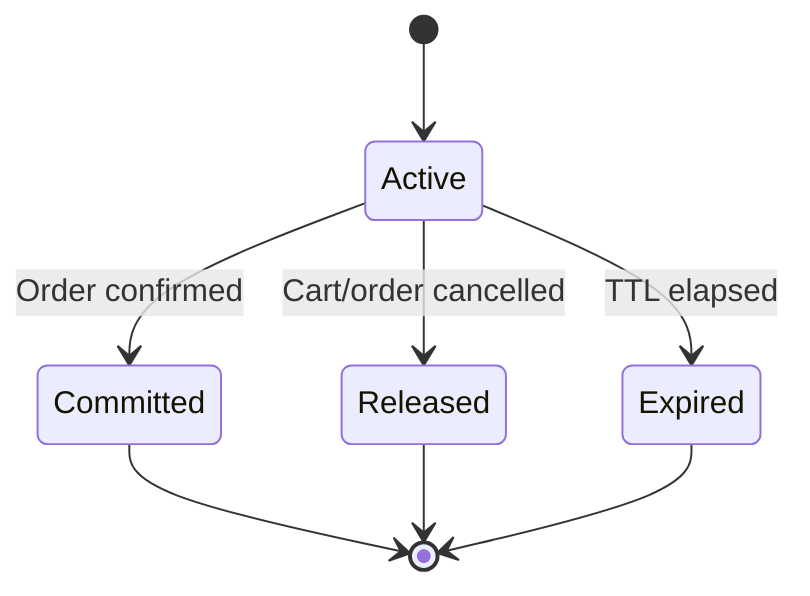

# Inventory Service architecture

## Boundary

Inventory Service owns stock quantities and their lifecycle. Product Service
owns products, variants, SKUs, prices, and publication status. Inventory stores
a minimal event-driven SKU projection only to validate references and seller
ownership.

## Quantity invariant

For every inventory item:

```text
available = on_hand - reserved
0 <= reserved <= on_hand
```

All adjustments, reservations, commits, releases, and expirations lock the
inventory row with `SELECT ... FOR UPDATE`. Database check constraints provide a
second line of protection.

## Reservation lifecycle



Committed, released, and expired reservations are terminal.

## Security

- Public availability reads do not require a token.
- Seller inventory management requires `seller` or `admin`.
- Customer reservations use the Identity JWT subject as `customer_id`.
- Product event projection requires the `inventory:sync` service scope.
- Expiration workers require the `inventory:expire` service scope.
- Tokens are verified with Identity Service JWKS and checked for `kid`,
  algorithm, issuer, audience, subject, expiration, and `nbf`.

## Events

The transactional outbox emits versioned events including:

- `inventory.item.created.v1`
- `inventory.item.updated.v1`
- `inventory.stock.adjusted.v1`
- `inventory.stock.low.v1`
- `inventory.reservation.created.v1`
- `inventory.reservation.committed.v1`
- `inventory.reservation.released.v1`
- `inventory.reservation.expired.v1`

An external publisher should send pending events to RabbitMQ or Kafka and mark
them published. Notification Service remains internal and continues using its
`INTERNAL_API_KEY`; consumers may call it after receiving low-stock events.
