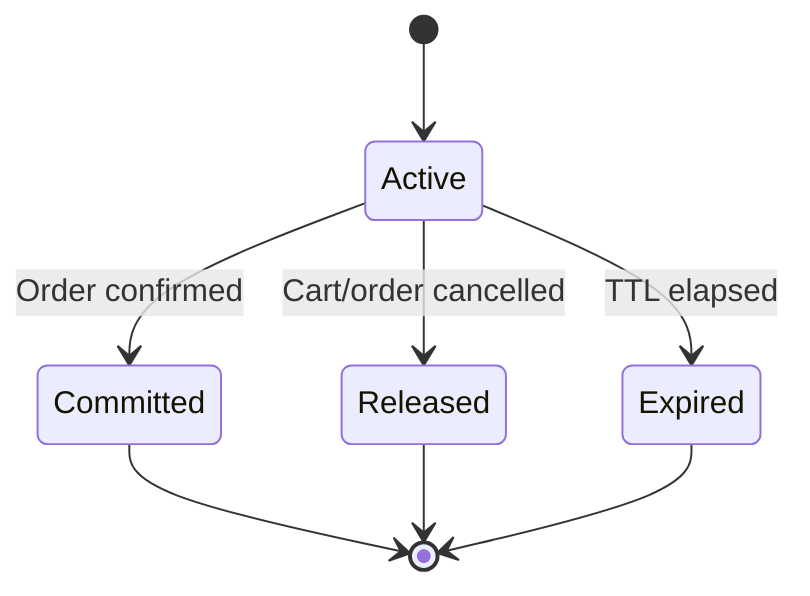

# Inventory Service architecture

## Boundary

Inventory Service owns stock quantities and their lifecycle. Product Service
owns products, variants, SKUs, prices, and publication status. Inventory stores
a minimal event-driven SKU projection only to validate references and seller
ownership.

## Quantity invariant

For every inventory item:

```text
available = on_hand - reserved
0 <= reserved <= on_hand
```

All adjustments, reservations, commits, releases, and expirations lock the
inventory row with `SELECT ... FOR UPDATE`. Database check constraints provide a
second line of protection.

## Reservation lifecycle



Committed, released, and expired reservations are terminal.

## Security

- Public availability reads do not require a token.
- Seller inventory management requires `seller` or `admin`.
- Customer reservations use the Identity JWT subject as `customer_id`.
- Product event projection requires the `inventory:sync` service scope.
- Expiration workers require the `inventory:expire` service scope. **Gap:**
  no client is currently registered for this scope in auth-service, and
  nothing in this stack (no cron, no scheduler) actually calls
  `POST /internal/reservations/expire` — the sweep exists but nothing
  drives it, so expired reservations don't release stock on their own.
  See `CLAUDE.md`'s "Known gaps" section and
  `services/order-service/docs/inventory-checkout-contract.md`.
- **Gap:** the checkout endpoints
  (`/internal/checkout/reservations/batch`, `/{group_id}/commit`,
  `/{group_id}/release`) have no dedicated scope at all — they only
  require `Depends(get_current_principal)`, i.e. any valid JWT (buyer,
  seller, admin, or any service token), unlike `inventory:sync` and
  `inventory:expire` above. There is no `inventory:checkout` scope in
  this codebase despite the intent implied in
  `services/order-service/docs/inventory-checkout-contract.md`
  ("authenticate the buyer or an Order service token delegated for that
  buyer"). Any buyer's own JWT can call the batch-reserve endpoint
  directly today, bypassing Cart/Order's business rules.
- Tokens are verified with Identity Service JWKS and checked for `kid`,
  algorithm, issuer, audience, subject, expiration, and `nbf`.

## Events

The transactional outbox emits versioned events including:

- `inventory.item.created.v1`
- `inventory.item.updated.v1`
- `inventory.stock.adjusted.v1`
- `inventory.stock.low.v1`
- `inventory.reservation.created.v1`
- `inventory.reservation.committed.v1`
- `inventory.reservation.released.v1`
- `inventory.reservation.expired.v1`

An external publisher should send pending events to RabbitMQ or Kafka and mark
them published. Notification Service remains internal and continues using its
`INTERNAL_API_KEY`; consumers may call it after receiving low-stock events.

**Gap:** `OutboxEvent` has no `request_id`/`correlation_id` column, and
`InventoryService._event()`'s payload doesn't carry one either —
`CorrelationIdMiddleware`'s `X-Request-ID` is propagated correctly
everywhere else (forwarded by order-service, captured on every
`AuditLog` row) but stops short of these events. A future consumer of
this outbox would have no way to trace an event back to its originating
request. order-service's own `OutboxEvent` model has and populates this
column — mirror that here.
